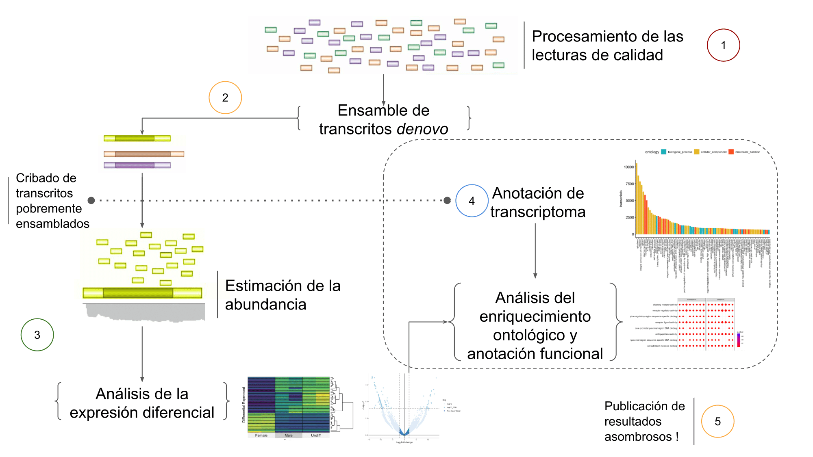

A non-guided transcriptome assembly usually aims to the _de novo_ assembly method of creating a transcriptome without the aid of a reference genome. The availability of Next Generation Sequencing (NGS) technologies allows researchers to capture the spatial or temporal profile of gene expresion from a huge types of biological samples. The Following markdown describe an integrative workflow analysis in RNA-seq data based on the current bioinformatic methods.

> -Ricardo Gore

## Outlines

* [Processing Raw libraries ](./markdown/Processing.md).
* [Running Trinity ](./markdown/denovo-Assembly.md).
* [Transrating Assembly ](./markdown/transrate.md).
* [Annotation ](./markdown/trinotate.md).
* [Abundance ](./markdown/RSEM.md).
* [Differential Expression ](./markdown/DiffExp.md).
* [Functional Annotation ](./markdown/DE-ontology.md).

### Flow-analysis diagram




Starts working on ssh serve
```
ssh user@omica
```

```
Password: ******
```

The Center for Scientific Research and Higher Education of Ensenada (CICESE), Mexico have a computer cluster [(Paper) ](http://todos.cicese.mx/sitio/noticia.php?n=827#.WsJ-23XwZhE) with many bioinformatic apps installed within ready to implement by subscribed users.  

**Please, email PhD A. Lago in order to request a cluster account (a prior authorization from your responsal)**
