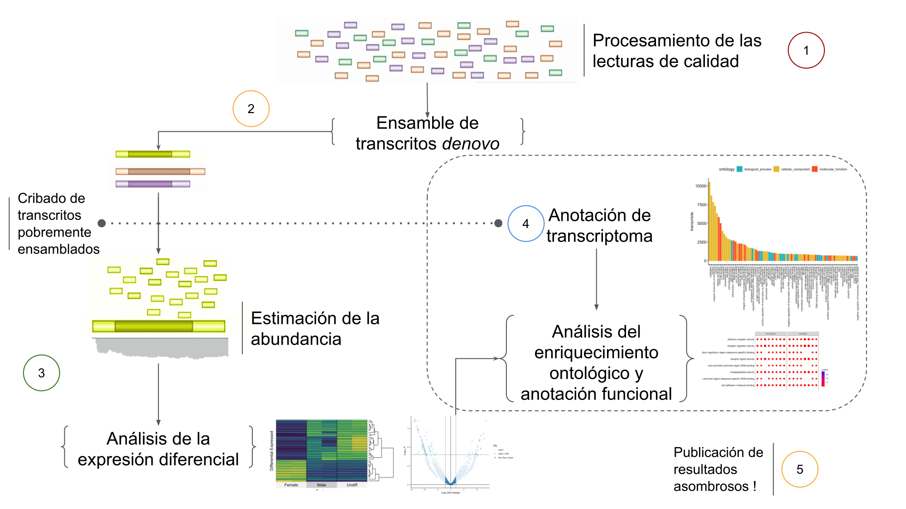

De novo transcriptome assembly is the _de novo_ sequence assembly method of creating a transcriptome without the aid of a reference genome (wikipedia). The availability of Next Generation Sequencing (NGS) technologies allows researchers to capture the spatial or temporal profile of gene expresion from a huge types of biological samples. The Following markdown describe an integrative workflow analysis in RNA-seq data based on the current bioinformatic methods.

> -Ricardo Gore

## Outlines

* [Processing Raw libraries ](./markdown/Processing).
* [Running Trinity ](./markdown/denovo-Assembly).
* [Transrating Assembly ](./markdown/transrate).
* [Annotation ](./markdown/trinotate).
* [Abundance ](./markdown/RSEM).
* [Differential Expression ](./markdown/DiffExp).
* [Functional Annotation ](./markdown/DE-ontology).

Text can be **bold**, _italic_, or ~~strikethrough~~.

There should be whitespace between paragraphs.

There should be whitespace between paragraphs. We recommend including a README, or a file with information about your project.

### Flow-analysis diagram




Starts working on ssh serve

```shell
ssh user@omica
```

```shell
Password: ******
```

The Center for Scientific Research and Higher Education of Ensenada (CICESE), Mexico have a computer cluster [(Paper) ](http://todos.cicese.mx/sitio/noticia.php?n=827#.WsJ-23XwZhE) with many bioinformatic apps installed within ready to implement by subscribed users.  

Please, email PhD A. Lago in order to request a cluster account (a prior authorization from your responsal)