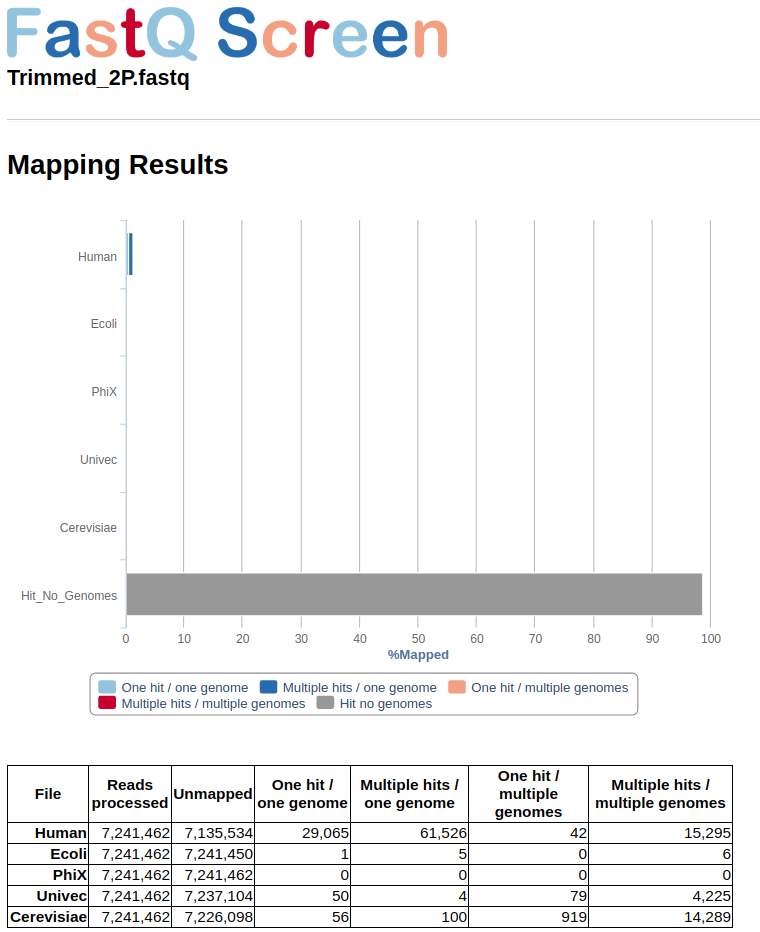

[back to Menu](../)

# [](#header-1) Processing Raw Libraries

Sanger sequencing perform a quality profile per nucleotide during sequencing as method to determine accuracy of the base calling position. It value is an [ASCII character called Phred score](https://en.wikipedia.org/wiki/Phred_quality_score) and can be used to separete good from bad reads sequenced (`Phred > Q score`). Phred quality scores Q 
are defined as a property which is logarithmically correlated to the probabilities P of incorrect base-calling (Base call accuracy). For example, if Phred assigns a quality score of 30 to a base, the chances that this base is called incorrectly are 1 in 1000. This quality details can be found below each sequence line within any fastq file.

Ussualy, errors during illumina sequencing are in the 5' primer as high Q score whereas 3' primer usually is degraded. Before starting your assembly you need to check and remove the set of low-quality sequence from your libraries as follow: 

- Quality Control
  - Checking Quality Control with `fastqc`
  - Aggregate results with `multiqc`
  - Remove low-quality sequence with `trimmomatic`
- Screening composition of the libraries 
  - Remove PhiX, Vectors or other contaminantes with `fastQ Screen`

## [](#header-2) FastQC

FastQC aims to provide a simple way to do some quality control checks on raw sequence data coming from high throughput sequencing pipelines. It provides a modular set of analyses which you can use to give a quick impression of whether your data has any problems of which you should be aware before doing any further analysis. 

> To details visit Babraham Site [here](https://www.bioinformatics.babraham.ac.uk/projects/fastqc/)

It can be run easely through all your fastq libraries as follow:

```shell
$ mkdir fastqc
$ srun -n 1 fastqc *.gz -t 24 -o ./fastqc &
```

## [](#header-2) MultiQC

In addition, you can aggregate results from fastqc across all your libraries (`zip format`) into a single report using multiqc tool. And can be run as follow:

```shell
$ mkdir multiqc
$ export PATH=/LUSTRE/apps/Anaconda/conda2/bin:$PATH
$ source activate multiqc_py2.7
$ multiqc ./fastqc/*zip -o ./multiqc --data-format json --export
```

A complete example report coud be visualized in the next file [multiqc.html](../examples/raw_processing/multiqc_report.html)

> To details visit site [here](https://github.com/ewels/MultiQC)


## [](#header-2) Trimmomatic

Trimmomatic performs a variety of useful trimming tasks for illumina paired-end and single ended data.The selection of trimming steps and their associated parameters are supplied on the command line. The follow syntaxis is configure to clip the adapter content for each library using the TruSeq3-PE; then, reads below the 36 bases long are dropped and average quality ≤ 25 are cutted within a sliding window of 5-bases. Also, 5-bases heads are cropped per read. 

> By default the value for $TRUSEQ and $TRIMMOMATIC refers to the path where the files are found. Please cut and paste the path variables within the cluster as follow:

>TRIMMOMATIC=/LUSTRE/bioinformatica_data/RNA/ricardo/bioinformatics/Trimmomatic-0.36

> TRUSEQ=/home/rgomez


```shell
/// loading Java current version
$ module load jdk1.8.0_60
$ for i in $(ls *gz | grep fastq); 
do 
  FORWARD=$(echo $i | grep R1); \
  REVERSE=$(echo $i | grep R2); \
java -jar $TRIMMOMATIC/trimmomatic-0.36.jar PE -phred33 \
      $FORWARD $REVERSE \
      ${FORWARD%.fastq.gz}.P.qtrim.fq.gz ${FORWARD%.fastq.gz}.UP.qtrim.fq.gz \
      ${REVERSE%.fastq.gz}.P.qtrim.fq.gz ${REVERSE%.fastq.gz}.UP.qtrim.fq.gz \
      ILLUMINACLIP:$TRUSEQ/TruSeq3-PE-2.fa:2:30:10 HEADCROP:5 SLIDINGWINDOW:4:15 MINLEN:36 LEADING:5 TRAILING:5
```

The current trimming steps will perform the follow:

* ILLUMINACLIP: Cut adapter and other illumina-specific sequences from the read
* SLIDINGWINDOW: Perform a sliding window trimming, cutting once the average quality within the window falls below a threshold.
* HEADCROP: Cut the specified number of bases from the start of the read
* MINLEN: Drop the read if it is below a specified length
* LEADING: Cut bases off the start of a read, if below a threshold quality
* TRAILING: Cut bases off the end of a read, if below a threshold quality

> To details visit site [here](http://www.usadellab.org/cms/?page=trimmomatic)

> Trinity as embed the configuration to run trimmomatic automatically before the assembly; We prefer this way, but also you can run independently as code above or skip this part and run fastq Screen as final step before assembly.

## [](#header-2) FastQ Screen (Optional !)

FastQ Screen allows you to set up a standard set of libraries against which all of your sequences can be searched. Your search libraries might contain the genomes of all of the organisms you work on, along with PhiX, Vectors or other contaminants commonly seen in sequencing experiments.

We recomend to integrate in this step the non redundant Univec database. UniVec is a database that can be used to quickly identify segments within nucleic acid sequences which may be of vector origin (vector contamination). In addition to vector sequences, UniVec also contains sequences for those adapters, linkers, and primers commonly used in the process of cloning cDNA or genomic DNA. This enables contamination with these oligonucleotide sequences to be found during the vector screen (Pati A. et al 2015).

The follow table show the reference used in this step:

* * * 

| Type        | Reference          | Source |
|:-------------|:------------------|:------|
| Laboratory   | PhiX | Enterobacterial Phage ( genome PhiX174) |
|   | UniVec   | Adapters, common contaminant  |
|              | _Homo Sapiens_       | Human (genome versión 38)   |
|              | _Saccharomyce Cerevisiae_ | Yeast  |


For any dabase screening versus your libraries fastq Screen provide a tab-delimited configure file to set up the reference list of databases of your chose. Also, fastq screeen cat implement either, bowtie (used for sequences less than 100 bp ie. small RNAs) or bowtie2 (bw2 used in paired-end sequences round to 200 bp). In this way, you need to index your databases before modify the configure file as this example:  
 
```shell 
$ srun bowtie2-build reference.fa reference &
```
Finally, modify the configure file (dowload a template [here](../examples/fastq_screen/fastq_screen.conf)) and then run the tool:

```shell
fastq_screen \
  --aligner bowtie2 \
  --conf fastq_screen.conf \
  --nohits \
  --outdir ./output Trimmed_2P.fastq
```
> To details in how to configure `fastq_screen` visit the Babraham Site [here](https://www.bioinformatics.babraham.ac.uk/projects/fastq_screen/fastq_screen_documentation.html)

The grey bar from figure in below space shows than more than 90 % of reads had not hits with any from the reference used in the configure file. Those reads are saved in a file with `tagged_filter.fastq` extention and are requiered for Assembly step.



[back to Menu](../)

* * *
