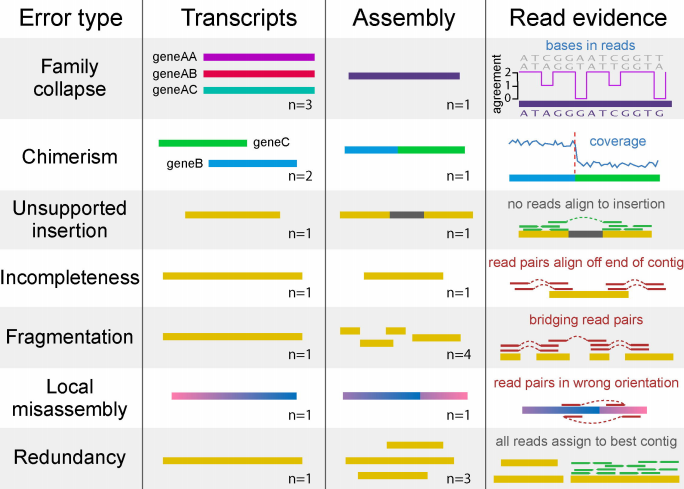

Once your assembly is complete, you'll want to know [how 'good' it is](https://github.com/trinityrnaseq/trinityrnaseq/wiki/Transcriptome-Assembly-Quality-Assessment), and you might want to compare the quality of the assembly to similar assemblies generated by alternative assemblers, or having run an assembly with different parameters.

[Transrate](http://hibberdlab.com/transrate/) is software for de-novo transcriptome assembly quality analysis. It examines your assembly in detail and compares it to experimental evidence such as the sequencing reads, reporting quality scores for contigs and assemblies. This allows you to choose between assemblers and parameters, filter out the bad contigs from an assembly, and help decide when to stop trying to improve the assembly.

Transrate relise on different type errors reporter experimentally: 

Error type:
- Family collapse (gene AA, AB, and AC collapsed as a single hybrid contig...bases in read as a disagrement in their entropy) 
- Chimeris (contig compuse from two disting transcripts (may or may not be related)...coverage is non uniform)
- Unsupported insertion (the new contig contain a fragment inserted along them, therefore pseudo-contig have not good aligned...no reads align to insertion)
- Incompletness (the contig lengh is small in comparison with the reads-gene where it came...read pairs align off end of contig)
- Fragmentation (A transcript result in a small diferent set of contig ...result in bridging reads pairs)
- Local misassembly (transcript assembly is in a wrong orientation afer k-mering...read pairs in wrong orientation ...These are detectable when both members of a read pair align to a single contig, but in a manner inconsistent with the sequencing protocol) <-- no detected in a non-strand mode setup
- Redundancy (A transcript result in a diferent set of contigs ... all reads assign to best contig)

[transrate paper](https://genome.cshlp.org/content/early/2016/06/01/gr.196469.115.full.pdf+html)



Whinin your _work directory_ lets make a new directory with name _transrate_ and go in to start working in:

```shell
mkdir transrate && cd transrate 
```

Lets to use the command shell `ln -s` in order to make a symbolic link from the assembly with name Trinity.fasta:

```shell
ln -s ../trinity_out/Trinity.fasta .
```

Then, concatenate in a unique dataset the left and right libraries for input in transrate; both data sets are necessary for transrating:

```shell
zcat ../trinity_out/*R1*P.qtrim.gz > R1.P.qtrim.fq &
zcat ../trinity_out/*R2*P.qtrim.gz > R2.P.qtrim.fq 
```

Now export the source from the transrate tool; and finally run transrate (considere to use the sbatch task manager in the cluster)

```shell
tool=/LUSTRE/bioinformatica_data/RNA/ricardo/bioinformatics/transrate-1.0.3-linux-x86_64/
export PATH=$tool:$PATH
```

```shell
transrate \
    --assembly Trinity.fasta \
    --left R1.P.qtrim.fq \
    --right R2.P.qtrim.fq \
    --threads 96 \
    --output gcontigs 1> transrate.log &
```

The `transrate.log` file include some statistics like:

```
[ INFO] 2018-03-02 00:41:37 : Calculating contig metrics...
[ INFO] 2018-03-02 00:41:56 : Contig metrics:
[ INFO] 2018-03-02 00:41:56 : -----------------------------------
[ INFO] 2018-03-02 00:41:56 : n seqs                       147454
[ INFO] 2018-03-02 00:41:56 : smallest                        201
[ INFO] 2018-03-02 00:41:56 : largest                       10795
[ INFO] 2018-03-02 00:41:56 : n bases                   108715008
[ INFO] 2018-03-02 00:41:56 : mean len                     737.28
[ INFO] 2018-03-02 00:41:56 : n under 200                       0
[ INFO] 2018-03-02 00:41:56 : n over 1k                     33509
[ INFO] 2018-03-02 00:41:56 : n over 10k                        1
[ INFO] 2018-03-02 00:41:56 : n with orf                    40996
[ INFO] 2018-03-02 00:41:56 : mean orf percent              58.76
[ INFO] 2018-03-02 00:41:56 : n90                             308
[ INFO] 2018-03-02 00:41:56 : n70                             640
[ INFO] 2018-03-02 00:41:56 : n50                            1121
[ INFO] 2018-03-02 00:41:56 : n30                            1754
[ INFO] 2018-03-02 00:41:56 : n10                            2818
[ INFO] 2018-03-02 00:41:56 : gc                             0.39
[ INFO] 2018-03-02 00:41:56 : bases n                           0
[ INFO] 2018-03-02 00:41:56 : proportion n                    0.0
[ INFO] 2018-03-02 00:41:56 : Contig metrics done in 19 seconds
[ INFO] 2018-03-02 00:41:56 : Calculating read diagnostics...
[ INFO] 2018-03-02 01:00:20 : Read mapping metrics:
[ INFO] 2018-03-02 01:00:20 : -----------------------------------
[ INFO] 2018-03-02 01:00:20 : fragments                  51394897
[ INFO] 2018-03-02 01:00:20 : fragments mapped           19860500
[ INFO] 2018-03-02 01:00:20 : p fragments mapped             0.39
[ INFO] 2018-03-02 01:00:20 : good mappings              17246823
[ INFO] 2018-03-02 01:00:20 : p good mapping                 0.34
[ INFO] 2018-03-02 01:00:20 : bad mappings                2613677
[ INFO] 2018-03-02 01:00:20 : potential bridges                 0
[ INFO] 2018-03-02 01:00:20 : bases uncovered            68043780
[ INFO] 2018-03-02 01:00:20 : p bases uncovered              0.63
[ INFO] 2018-03-02 01:00:20 : contigs uncovbase            124374
[ INFO] 2018-03-02 01:00:20 : p contigs uncovbase            0.84
[ INFO] 2018-03-02 01:00:20 : contigs uncovered            147454
[ INFO] 2018-03-02 01:00:20 : p contigs uncovered             1.0
[ INFO] 2018-03-02 01:00:20 : contigs lowcovered           147454
[ INFO] 2018-03-02 01:00:20 : p contigs lowcovered            1.0
[ INFO] 2018-03-02 01:00:20 : contigs segmented             15457
[ INFO] 2018-03-02 01:00:20 : p contigs segmented             0.1
[ INFO] 2018-03-02 01:00:20 : Read metrics done in 1103 seconds
[ INFO] 2018-03-02 01:00:20 : No reference provided, skipping comparative diagnostics
[ INFO] 2018-03-02 01:00:40 : TRANSRATE ASSEMBLY SCORE     0.0297
[ INFO] 2018-03-02 01:00:40 : -----------------------------------
[ INFO] 2018-03-02 01:00:40 : TRANSRATE OPTIMAL SCORE       0.123
[ INFO] 2018-03-02 01:00:40 : TRANSRATE OPTIMAL CUTOFF     0.2353
[ INFO] 2018-03-02 01:00:41 : good contigs                  65516
[ INFO] 2018-03-02 01:00:41 : p good contigs                 0.44
[ INFO] 2018-03-02 01:00:41 : Writing contig metrics for each contig to /LUSTRE/bioinformatica_data/genomica_funcional/rgomez/oyster-rawdata/gonada_all_sex_vs_hc/transrate/gcontigs/Trinity/contigs.csv
[ INFO] 2018-03-02 01:01:02 : Writing analysis results to assemblies.csv

```
The optimal cutoff from 0.2352 were calculated with transrate and used to keep good contigs assembled (from the total contigs 44% were considere as good).  Try comparing results with the [previous Assembly quality statistics](denovo-Assembly) which came from the same set of libraries. Are there some difference ?

lets start into R

```R
contigs <- read.csv(".gcontigs/Trinity/contigs.csv", header=T)

contigs['group'] <- NA
contigs[which(contigs['score'] ==  0.0297),'group'] <- 'Assembly Score'
contigs[which(contigs['score'] <=  0.123),'group'] <- 'Optimal Score'
contigs[which(contigs['score'] <=0.2353),'group'] <- 'Optimal Cutoff'

table(contigs$group)
```

[back to Menu](../)
