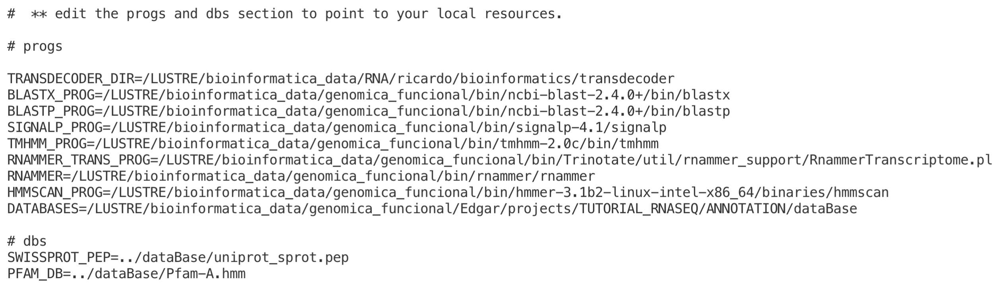
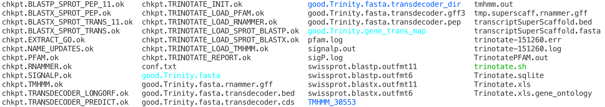
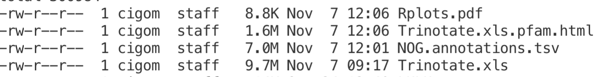
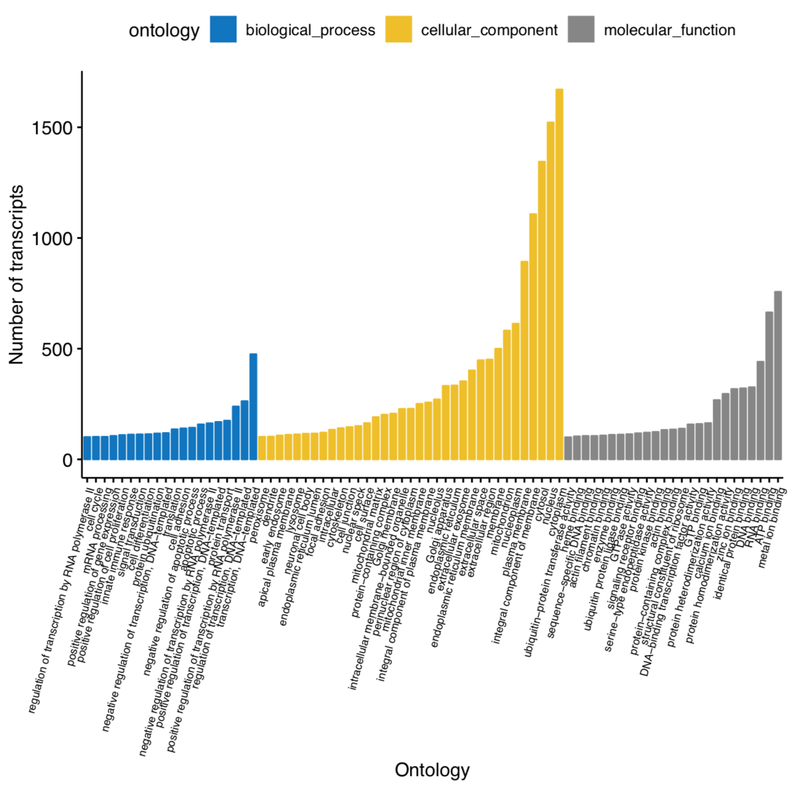
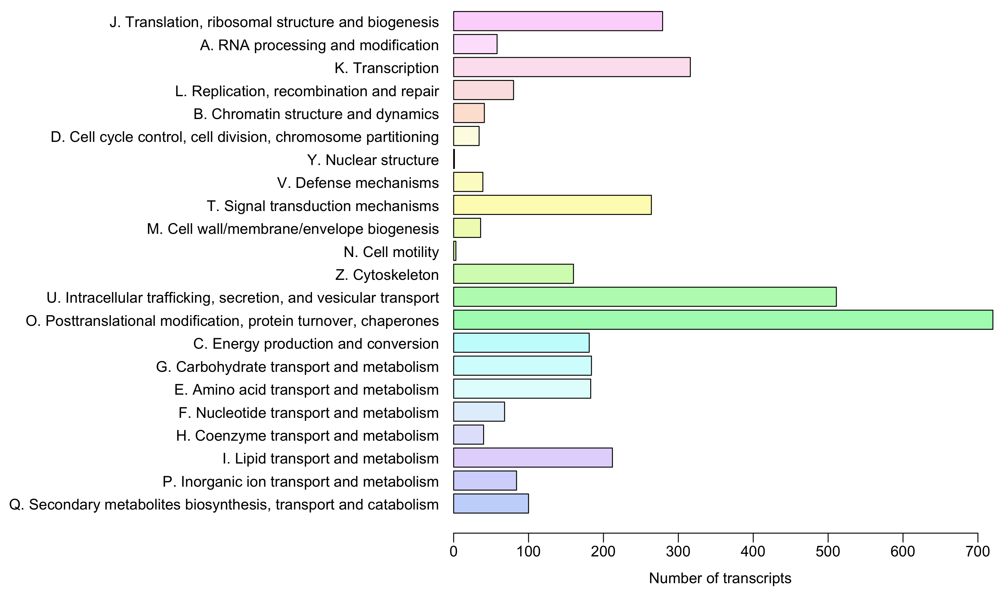
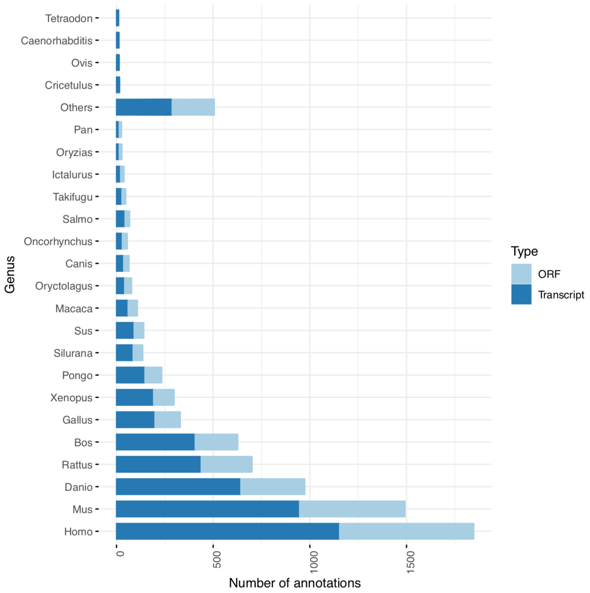
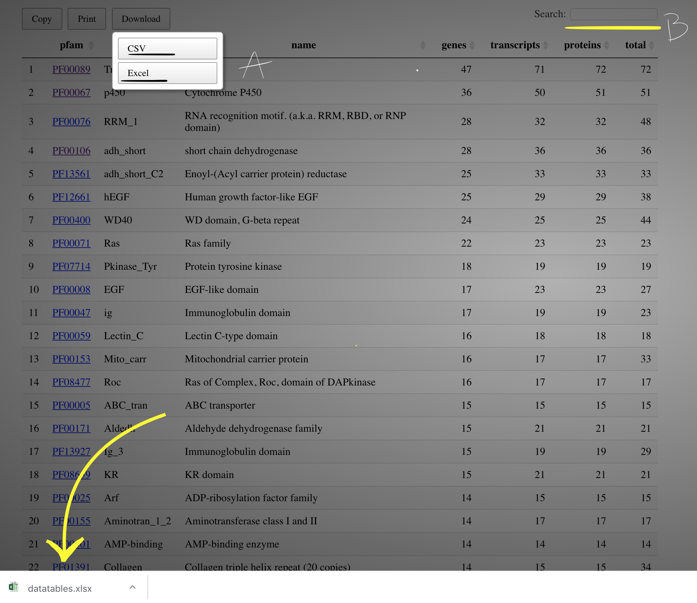

[back to Menu](../)


# [](#header-1) Anotación funcional del transcriptoma

Después de ensamblar tu transcriptoma, es necesario que se anote cada contig (ie. lectura ensamblada o transcrito) a una base de datos de referencia de secuencias homólogas de modo que se prediga el origen biológico de cada uno de tus genes expresados en tu modelo experimental. Herramientas como *blast2go* son utilizadas para realizar este análisis; sin embargo, dicha herramienta no es gratuita en su totalidad. En esta vía, *trinotate* es un paquete bioinformático gratuito - muy completo a mi parecer - para los análisis de anotación funcional de tu ensamble. Trinotate hace uso de varios métodos diferentes para la anotación funcional de genes, incluida la búsqueda de homología a datos de secuencia conocidos (BLAST+ / SwissProt), identificación de dominio de proteína (HMMER/PFAM), péptido señal proteico y predicción de dominio transmembrana (signalP/tmHMMM) aprovechando varias bases de datos de anotación (bases de datos eggNOG / GO / Kegg) y un solo flujo de análisis que encarga de lo siguiente:

●      **Anotación de homología de genes**

●      **Identificación de regiones codificantes**

●      **Pfam:** **identificación de dominio proteicos**

●      **Predicción de señales peptídicas**

●      **Predicción de dominios transmembranal**

●      **Identificar transcritos de origen ribosomal**

En la experiencia personal, el uso de *trinotate* ha dado como resultado un mejor rendimiento (menos tiempo computacional y un análisis bioinformático enriquecido) que la contraparte de *blast2go* y útil para anotar automáticamente un flujo de trabajo a la vez. En el siguiente capítulo incluimos la estrategia de usar trinotate hasta obtener visualizaciones publicables y en las últimas páginas encontrarás el desglose de los análisis que trinotate lleva a cabo en su flujo de trabajo. Partimos del conocimiento de que tenemos un montón de secuencias de nuestro ensamble, además hemos identificado un subconjunto de ellas que parecen estar  expresándose diferencialmente a lo largo de nuestras condiciones, pero no sabemos realmente qué son o qué funciones biológicas podrían tener.  

## [](#header-2) **Preparar bases de datos**

En esta ocasión implementaremos el comando *source* para exportar algunas variables de ambiente de linux dentro del cluster:

 

```bash
SOURCE=/LUSTRE/bioinformatica_data/genomica_funcional/scripts/exports
source $SOURCE
```

Posteriormente, haremos un directorio de trabajo en el cual descargamos y damos formato a nuestras bases de datos de secuencias:

```bash
mkdir dataBase
cd dataBase
```

El siguiente paso es generar un contenedor de datos del tipo *SLQlite*, que es implementado por la paqueteria trinotate para empaquetar toda la información en una sola base (para mayor detalle sobre SQlite visitar: https://www.sqlite.org/about.html). 

 El comando *Build_Trinotate_Boilerplate_SQLite_db.pl* llevara acabo la descarga de las bases eggNOG / GO / Kegg, PFAM y SwissProt con el fin de asociar y contener toda esta información en un solo archivo de nombre *Trinotate.sqlite* o el prefijo que se desee poner al archivo (este paso demora entre 40 minutos y 70 minutos según la velocidad de descarga de internet). 

 

```bash
$NOTATE_AD/Build_Trinotate_Boilerplate_SQLite_db.pl Trinotate &> build.log &
```

Como resultado tendremos los siguientes archivos en la carpeta creada “dataBase” (la información eggNOG / GO / Kegg ya están contenida en el contenedor SQLite, mientras que las bases uniprot_sprot.pep y Pfam-A.hmm quedan como referencia para los análisis posteriores):

```bash
-rw-rw-rw- 1 rgomez gen_poblacional 347M Nov  6 14:55 Trinotate.sqlite
-rw-rw-rw- 1 rgomez gen_poblacional 1.4G Nov  6 14:55 Pfam-A.hmm.gz
-rw-rw-rw- 1 rgomez gen_poblacional 1.9M Nov  6 14:46 Trinotate.TaxonomyIndex
-rw-rw-rw- 1 rgomez gen_poblacional 159M Nov  6 14:46 Trinotate.UniprotIndex
-rw-rw-rw- 1 rgomez gen_poblacional 227M Nov  6 14:46 uniprot_sprot.pep
```

Finalmente damos formato a las siguientes bases de datos “*uniprot_sprot.pep*” y “*Pfam-A.hmm*” de la siguiente manera:

 ```bash
srun $BLAST/makeblastdb -in uniprot_sprot.pep -dbtype prot &
srun gunzip Pfam-A.hmm.gz &
srun $HMM/hmmpress Pfam-A.hmm &> hmmpress.log &
 ```

Te darás cuenta que implementamos un comando nuevo llamado *srun,* este es similar a ejecutar el administrador de tareas sbach (slurm) dentro del cluster. Y es útil cuando ejecutamos comando que no requieren más de un nodo para su procesamiento. 

Como resultado de preparar las bases de datos tendrás los siguientes archivos adicionales: 

```bash
-rw-rw-rw- 1 rgomez gen_poblacional  69M Nov  6 17:57 uniprot_sprot.pep.phr
-rw-rw-rw- 1 rgomez gen_poblacional 4.3M Nov  6 17:57 uniprot_sprot.pep.pin
-rw-rw-rw- 1 rgomez gen_poblacional 192M Nov  6 17:57 uniprot_sprot.pep.psq
-rw-rw-rw- 1 rgomez gen_poblacional    0 Nov  6 15:18 hmmpress.log
-rw-rw-rw- 1 rgomez gen_poblacional 314M Nov  6 15:17 Pfam-A.hmm.h3f
-rw-rw-rw- 1 rgomez gen_poblacional 1.2M Nov  6 15:17 Pfam-A.hmm.h3i
-rw-rw-rw- 1 rgomez gen_poblacional 567M Nov  6 15:17 Pfam-A.hmm.h3m
-rw-rw-rw- 1 rgomez gen_poblacional 667M Nov  6 15:17 Pfam-A.hmm.h3p
-rw-rw-rw- 1 rgomez gen_poblacional 1.3M Nov  6 14:55 build.log

```

## [](#header-2) Automatización de la anotación

El siguiente paso es correr el análisis de anotación funcional. Los desarrolladores de Trinotate crearon un script que automáticamente lleva a cabo todo el análisis descrito con anterioridad. Para este paso, saldremos de la carpeta *dataBase* y trabajaremos en un nuevo directorio que llamaremos ANNOTATION (/LUSTRE/bioinformatica_data/genomica_funcional/Edgar/projects/TUTORIAL_RNASEQ/ANNOTATION); En este nuevo directorio haremos una copia o link simbólico de nuestro ensamble *good.Trinity.fasta* y nuestro contenedor de bases *Trinotate.sqlite;* ejemplo:


```bash
cd ../
PATH=/`pwd`

mkdir ANNOTATION
cd ANNOTATION

cp $PATH/dataBase/Trinotate.sqlite .

ln -s $PATH/ASSEMBLY/QC_ASSEMBLY/gcontigs/Trinity/good.Trinity.fasta .

```

además de llevar a cabo los siguientes preparativos:

#### [](#header-4) 1) 	Formato de la relación de isoformas y genes

```bash
UTILS=/LUSTRE/apps/bioinformatica/trinityrnaseq/util/support_scripts
$UTILS/get_Trinity_gene_to_trans_map.pl good.Trinity.fasta > good.Trinity.gene_trans_map
```
#### [](#header-4) 2 )	Modificación del archivo de configuración

Abriremos el archivo *conf.txt* de configuración usando cualquier editor de texto (vi, nano, etc) y modificaremos algunas rutas de programas (“progs” ) y bases de datos ( “dbs”) dentro de su contenido. En la siguiente figura nos daremos cuenta que en la ruta de programas están definidas las rutas absolutas donde estas herramientas están alojadas dentro del cluster, por lo que solo será necesario establecer la ruta relativa del directorio donde colocamos nuestras bases de datos en el paso de la construcción del archivo *SQLite*. 



Puedes hacer una copia del archivo de configuracion *conf.txt* desde la ruta de instalacion del programa  `/LUSTRE/apps/bioinformatica/Trinotate/auto/conf.txt` o desde la ruta descrita en este tutorial: `/LUSTRE/bioinformatica_data/genomica_funcional/Edgar/projects/TUTORIAL_RNASEQ/ANNOTATION/conf.txt `que viene pre-configurado para usar en el cluster omica:

 ```bash
cp /LUSTRE/bioinformatica_data/genomica_funcional/Edgar/projects/TUTORIAL_RNASEQ/ANNOTATION/conf.txt  MiDirectorioDeTrabajo
 ```

 Finalmente, haremos el siguiente script sbatch y ejecutaremos en el cluster en el directorio de trabajo ANNOTATION donde se encuentran los archivos de entrada (El paso de la anotación puede demorar de 8 a 36 horas dependiendo del número de lecturas de tu ensamble)


●      good.Trinity.fasta, 

●      good.Trinity.gene_trans_map, 

●      Trinotate.sqlite y 

●      conf.txt. 

```bash
#!/bin/bash
### Directivas
#SBATCH -p cicese
#SBATCH --job-name=trinotate
#SBATCH --ntasks-per-node=24
#SBATCH -N 4
#SBATCH --output=trinotate-%j.log
#SBATCH --error=trinotate-%j.err
#SBATCH -t 6-00:00:00

RUN=/LUSTRE/apps/bioinformatica/Trinotate/auto/

$RUN/autoTrinotate.pl --Trinotate_sqlite Trinotate.sqlite \
                        --transcripts good.Trinity.fasta \
                        --gene_to_trans_map good.Trinity.gene_trans_map \
                        --conf conf.txt \
                        --CPU 96
exit
```
> The --CPU option will vary depend upon your slurm perameters


## [](#header-2) Resultados

Encontraremos diversos archivos en nuestro directorio de trabajo ANNOTATION, para cada una de las etapas del análisis, un archivo con extensión *ok es generado como punto de control de las etapas del análisis. El archivo de salida que nos interesa es el que tiene por nombre Trinotate.xls.


Si echamos un vistazo a nuestro archivo Trinotate.xls encontraremos 18 columnas separadas por tabuladores, en las cuales se describe de manera integral la información de anotación para cada uno de los transcritos del ensamble en el siguiente orden:

 

1. gene_id
2. transcript_id
3. sprot_Top_BLASTX_hit
4. RNAMMER
5. prot_id
6. prot_coords
7. sprot_Top_BLASTP_hit
8. custom_pombe_pep_BLASTX
9. custom_pombe_pep_BLASTP
10.  Pfam
11.  SignalP
12.  TmHMM
13.  eggnog
14.  Kegg
15.  gene_ontology_blast
16.  gene_ontology_pfam
17.  transcript
18.  peptide


Usemos una estrategia para manejar estos resultados es a través de la herramienta trinotateR en R  

### [](#header-3) **Uso de trinotateR para obtener la anotación de ontología de genes.**

trinotateR es un paquete (Chris Stubben, 2018) con funciones simples y útiles para manipular el producto final de *Trinotate*. La mayoría de las anotaciones contienen accesos múltiples en una lista delimitada por comillas y cada hit contiene múltiples campos en una lista delimitada por caracteres. Por ejemplo, la segunda anotación de Pfam a continuación contiene dos hits y cada hit contiene un id de pfam, símbolo, nombre, alineación y un valor E. Las funciones *split_pfam* dividen múltiples hits y campos, por lo que la segunda anotación Pfam ahora se imprime en las filas 2 y 3 a continuación.

Para fines prácticos, ejecutaremos un script que automatiza el resumen de resultados de trinotate desde R, para ello se requiere trabajar desde un equipo con R versión 3.5.0 o mayor. Supongamos entonces que trabajamos ahora desde un equipo personal; descargamos el archivo Trinotate.xls así como el script `annotation.R` de las siguiente manera:

```bash
mkdir results
cd results

curl https://raw.githubusercontent.com/RJEGR/infovis/master/annotation.R -o annotation.R
scp user@omica:/path_to_trinotate_results/Trinotate.xls .
```

Entonces ejecutamos el script dentro de una terminal estando en el mismo directorio de trabajo:

`Rscript --vanilla annotation.R Trinotate.xls`

Se imprimirá en pantalla el resumen de la anotación obtenida para el ensamble de interés de la siguiente manera:

|                      | unique | total |
| -------------------- | ------ | ----- |
| gene_id              | 11317  | 12163 |
| transcript_id        | 12074  | 12163 |
| sprot_Top_BLASTX_hit | 6544   | 6639  |
| gene_ontology_blast  | 4537   | 6591  |
| Kegg                 | 4407   | 5747  |
| eggnog               | 2444   | 5574  |
| prot_id              | 4139   | 4139  |
| prot_coords          | 2416   | 4139  |
| sprot_Top_BLASTP_hit | 3675   | 3743  |
| Pfam                 | 2986   | 3061  |
| gene_ontology_pfam   | 598    | 1908  |
| TmHMM                | 583    | 595   |
| RNAMMER              | 1      | 1     |
| SignalP              | 0      | 0     |
| transcript           | 0      | 0     |
| peptide              | 0      | 0     |

Otros archivos que se generan en tu nuevo directorio de trabajo son resultados en formato: `*.pdf` y `*.html`: 



En el documento pdf se contiene figuras sobre la anotación a lo largo de los transcritos procesados con el flujo de Trinotate mientras que el archivo html es un documento digital que contiene la anotación hecha con la base de datos de Pfam.

 Las figuras del documento pdf corresponde a la anotación ontológica (GO) la cual comprende el estado reportado sobre la función de un gen en particular respecto a tres aspectos: 

* Función molecular (actividades a nivel molecular realizadas por productos genéticos), 

* Componente celular (las ubicaciones relativas a las estructuras celulares en las que un producto génico desempeña una función) y 

* Proceso biológico (los procesos más grandes, o 'programas biológicos' realizados por múltiples actividades moleculares). 



Además, se incluye la anotación de la categoría funcional EggNOG 



Así como el perfil de taxones (nivel género) anotados en el *blastp* y *blastx* desarrollado en el flujo de análisis durante este manual: 



Por otra parte, el documento digital html consiste en una tabla que reporta las anotaciones de los dominio proteico encontrados en el ensamble; también nos da un resumen total del número de genes, transcritos y proteínas que tuvieron alguna anotación a lo largo del transcriptoma (últimas cuatro columnas de lado derecho); finalmente, dando click en los hipervínculos sombreados con color azul tiene acceso directo a la base de datos de familias proteicas según sea el identificador pfam anotado. 

Así también, el documento html permite hacer descarga (Panel A), copiar e imprimir los resultados ya sea total o parcialmente, si se efectúa una búsqueda (Panel B).



## [](#header-2) **Desglose de los análisis que se llevan a cabo en el flujo de análisis en trinotate:**

 

### [](#header-3) **Identificación de regiones codificantes**

El flujo de la anotación integra la herramienta *TransDecoder;* Esta es una herramienta útil para predecir regiones codificantes cualquier secuencia de nucleótidos a través de heurística codones y marcos de lectura abiertos (ORF). Esta información es útil para validar la expresión de transcritos que se ajustan al dogma central de la biología molecular: gen → ARN → proteína. Para mayor detalle del funcionamiento de esta herramienta visita la documentacion en google.

Ejecutar *TransDecoder* es un proceso de dos pasos. Primero ejecute el paso que identifica todos los ORF, seguido de ejecutar el paso que predice qué ORF es probable que estén codificados. Supongamos que estamos en nuestro directorio de trabajo ANNOTATION donde tenemos una copia de nuestro transcriptoma ensamblado (good.Trinity.fasta) y ejecutamos los siguientes fragmentos de código:

```bash
DECODER=/LUSTRE/apps/bioinformatica/TransDecoder-3.0.1/
UTILS=/LUSTRE/apps/bioinformatica/trinityrnaseq/util/support_scripts
$UTILS/get_Trinity_gene_to_trans_map.pl good.Trinity.fasta > good.Trinity.gene_trans_map
#1
srun $DECODER/TransDecoder.LongOrfs -t good.Trinity.fasta --gene_trans_map good.Trinity.gene_trans_map > transdecoder.log &
#2
srun $DECODER/TransDecoder.Predict -t good.Trinity.fasta --cpu 24 >> transdecoder.log & 
```

El archivo que más nos importa de nuestros resultados es el etiquetado con extensión `*pep`, que contiene las secuencias de proteínas correspondientes a las regiones de codificación predichas a lo largo de nuestras lecturas ensambladas. 

```bash
ll -h | grep transdecoder.pep
-rw-r--r-- 16:52 good.Trinity.fasta.transdecoder.pep
```

Este archivo *.pep* se utilizará para varias análisis de homologías de secuencia (ie. hits de blast) y otros análisis de bioinformáticos. En adición al *blastx* que llevamos a cabo en nuestro archivo good.Trinity.fasta en capítulos anteriores, anotamos la homología de nuestras secuencias de proteínas reportadas con *transdecoder*.

```bash
#!/bin/bash
### Directivas
#SBATCH -p cicese
#SBATCH --job-name=blastp
#SBATCH --ntasks-per-node=24
#SBATCH -N 2
#SBATCH --output=blastp_f6-%j.log
#SBATCH --error=blastp_f6-%j.err
#SBATCH -t 6-00:00:00

cd ${SLURM_SUBMIT_DIR}
DBS=/LUSTRE/bioinformatica_data/genomica_funcional/Laura/DB
BLAST=/LUSTRE/bioinformatica_data/genomica_funcional/bin/ncbi-blast-2.4.0+/bin/

$BLAST/blastp -query Trinity.fasta.transdecoder.pep \
         -db $DBS/Swissprot/uniprot_sprot.fasta -num_threads 24 \
         -max_target_seqs 1 -outfmt 6 -evalue 1e-5 \
          > swissprot.blastp.outfmt6
```

### [](#header-3) **Pfam:** **identificación de dominio proteicos**

Usando nuestras secuencias de proteínas reportadas con *transdecoder*, también ejecutemos una búsqueda HMMER en la base de datos de Pfam e identifiquemos los dominios conservados que pueden ser indicativos o sugerentes de función:

```bash
HMMSCAN=/LUSTRE/bioinformatica_data/genomica_funcional/bin/hmmer-3.1b2-linux-intel-x86_64/binaries
srun $HMMSCAN/hmmscan --cpu 24 --domtblout TrinotatePFAM.out Pfam-A.hmm good.Trinity.fasta.transdecoder.pep
```

### [](#header-3) **Predicción de señales peptídicas**

Las herramientas *signalP* y *tmhmm* son muy útiles para predecir señales peptídicas (señales de secreción) y dominios transmembrana, respectivamente.

```bash
SIGNALP=/LUSTRE/bioinformatica_data/genomica_funcional/bin/signalp-4.1

srun $SIGNALP/signalp -f short -n signalp.out good.Trinity.fasta.transdecoder.pep > sigP.log &
```

### [](#header-3) **Predicción de dominios transmembranal**

```bash
TMHMM=/LUSTRE/bioinformatica_data/genomica_funcional/bin/tmhmm-2.0c/bin

srun $TMHMM/tmhmm --short < good.Trinity.fasta.transdecoder.pep > tmhmm.out &
```

 

### [](#header-3) **Identificar transcritos de origen ribosomal**

```bash
RNAMMER_TRANS=/LUSTRE/bioinformatica_data/genomica_funcional/bin/Trinotate/util/rnammer_support

RNAMMER=/LUSTRE/bioinformatica_data/genomica_funcional/bin/rnammer/rnammer

srun $RNAMMER_TRANS/RnammerTranscriptome.pl --transcriptome good.Trinity.fasta --path_to_rnammer $RNAMMER &
```

Finalmente cargamos resultados en la base Trinotate.sqlite construida y copiada a tu directorio de trabajo:

 

```bash
TRINO=/LUSTRE/apps/bioinformatica/Trinotate/
export PATH=$TRINO:$PATH 

Trinotate Trinotate.sqlite init --gene_trans_map good.Trinity.gene_trans_map --transcript_fasta good.Trinity.fasta --transdecoder_pep good.Trinity.fasta.transdecoder.pep

```


### [](#header-3) **1)**    **Resultados a nivel proteina:**

```bash
Trinotate Trinotate.sqlite LOAD_swissprot_blastp swissprot.blastp.outfmt6
Trinotate Trinotate.sqlite LOAD_pfam TrinotatePFAM.out
Trinotate Trinotate.sqlite LOAD_signalp signalp.out
Trinotate Trinotate.sqlite LOAD_tmhmm tmhmm.out
```

### [](#header-3) **2)**    **Resultados a nivel RNA**

```bash
Trinotate Trinotate.sqlite  LOAD_swissprot_blastx ../BLAST/tutorial_sp_f6
Trinotate Trinotate.sqlite LOAD_rnammer good.Trinity.fasta.rnammer.gff
Trinotate Trinotate.sqlite report > Trinotate.xls 
```

### [](#header-3) **Adicionales:**

```bash
GO_NAME=/LUSTRE/apps/bioinformatica/Trinotate/util/
$GO_NAME/extract_GO_assignments_from_Trinotate_xls.pl  --Trinotate_xls Trinotate.xls -T

NAME_UPDATES=/LUSTRE/apps/bioinformatica/Trinotate/util/annotation_importer/
$NAME_UPDATES/import_transcript_names.pl Trinotate.sqlite Trinotate.xls

```

[Link to another page](another-page).